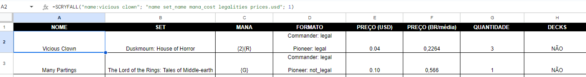

# Scryfall Google Sheets PT/BR
Este projeto é um fork da integração entre a API do [Scryfall](https://scryfall.com/docs/api) e o Google Sheets, originalmente criada por [April King](https://github.com/april). Esta versão adiciona novos campos e suporte ao idioma português do Brasil.


## Instalação
1. Copie o conteúdo do arquivo `scryfall-google-sheets.js` deste repositório.
2. Abra sua planilha no Google Sheets e vá em Extensões → Apps Scripts.
3. Cole o conteúdo no editor de scripts e clique em Salvar.
4. Volte para sua planilha. A função `=SCRYFALL()`estará disponível. 

## Exemplo de uso
A função `=SCRYFALL()` permite consultar o banco de dados da Scryfall diretamente do Google Sheets. A sintaxe da função é:
```
=SCRYFALL("name:many partings"; "name set_name mana_cost legalities prices.usd"; 1)
```
## Novos Recursos deste Fork
* **Campo de Preço em Dólar (USD):**  O preço das cartas em dólares (USD) é retornado diretamente da API da Scryfall.
* **Campo de Preço em Real (BRL):** Agora, o preço das cartas também é exibido em BRL, calculado automaticamente pela cotação do dólar.
* **Consulta por Formatos:** Adicionada a possibilidade de filtrar a legalidade em formatos específicos (ex.: Commander, Pioneer).
* **Quantidade de Cópias e Presença em Decks:** Adicionadas informações sobre o número de cópias e se a carta está em algum deck.

## Contribuições
Fork original: [Scryfall Google Sheets](https://github.com/scryfall/google-sheets)

Fork atualizado: [Google Sheets MTG](https://github.com/th1rt3en13/google-sheets-MTG)
